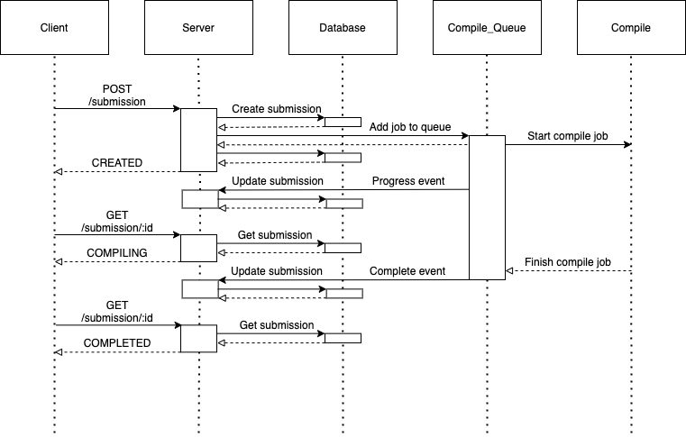

# Compile

> Clustered Arduino compile server. Each worker connects to a Redis-based queue and can process submissions concurrently. It is powered by [Throng](https://www.npmjs.com/package/throng) and [Bull](https://www.npmjs.com/package/bull).

 

## Structure

`compile` and `server` connect to the queue in [pub/sub](https://en.wikipedia.org/wiki/Publish–subscribe_pattern) fashion. As jobs make progress and eventually complete, events will be emitted. The `server` listens to these events and will update the submission in the `database` accordingly. This asynchronous processing reduces high latency requests on the  `server`, providing a more responsive experience. Additionally, `compile` can be [optimized](#Configuration) to easily run concurrent processes and jobs.

 

## Setup

`compile` depends on other services and must be run with the rest of the application. See the project [development](../README.md#development) setup for instructions.

 

## Configuration

`WEB_CONCURRENCY` 

- Spin up multiple processes to handle jobs to take advantage of more CPU cores
- See: https://devcenter.heroku.com/articles/node-concurrency for more info

`JOB_CONCURRENCY`

- The maximum number of jobs each worker should process at once
- Each job is CPU-intensive, so this value should not be too high

 

## Notes

This service was forked from spaceneedle's [Chromeduino](https://github.com/spaceneedle/Chromeduino) project. 

### Notice of Non-Affiliation and Disclaimer:

We are not affiliated, associated, authorized, endorsed by, or in any way officially connected with Arduino AG or Google LLC (“Google”), or any of their subsidiaries or their affiliates. The official Arduino AG website can be found at https://www.arduino.cc
The names "Chrome", "Chromebook", "Chromebox", "Arduino", and "Genuino" as well as related names, marks, emblems and images are registered trademarks of their respective owners.

