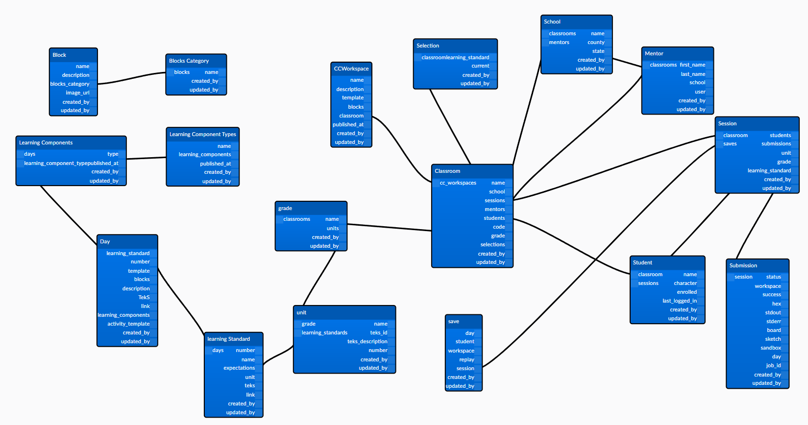

# Server

> Web server and application server that will serve static content and dynamic content over HTTP. It is powered by [Node](https://nodejs.org/en/), [Strapi](https://strapi.io/documentation/v3.x/getting-started/introduction.html), and [PostgreSQL](https://www.postgresql.org/). The file structure is defined by Strapi and is documented [here](https://docs-v3.strapi.io/developer-docs/latest/setup-deployment-guides/file-structure.html).

 

## Setup

`server` depends on other services and must be run with the rest of the application. See the project [development](../README.md#development) setup for instructions.

 

## Available scripts

* `yarn build-client` - Build client and add it to the public folder
* `yarn build` - Build the strapi admin panel

 

## Static Assets

All assets in the **public** directory will be served. The specifics are defined [here](https://docs-v3.strapi.io/developer-docs/latest/setup-deployment-guides/configurations.html#public-assets).

### Client

> When Docker builds the production container, it builds client and adds it to **public/client**

The [proxy](/server/middlewares/proxy/index.js) middleware handles serving **client/index.html**, passing off all client routes to react. All other client assets are served by strapi as public assets. The middleware was implemented to solve manual navigation to a non-root client route responding with a 404. Read more about this [here](https://github.com/STEM-C/STEM-C/pull/28#pullrequestreview-415846251).

 

## API Endpoints `/api`

> Built with [Node](https://nodejs.org/en/), [Koa](https://github.com/koajs/koa#readme), and [Bookshelf](https://bookshelfjs.org/), the REST API enables CRUD functionality with the application's content. Authentication is enabled via JWTs. The dbms is [PostgreSQL](https://www.postgresql.org/).

### Documentation

The latest API documentation is available on [Strapi Documentation](http://localhost:1337/documentation/v1.0.0) after you started your local development. You can view example request/responses and test it with your jwt token. 

### Authentication 

Mentors use the `local` provider routes, `/auth/local` and `/auth/local/register`, to login and register. Students login by joining a session with the route `/sessions/join/:code`. In both cases, a JWT will be issued on a successful response. Subsequent requests will need to send this JWT as a `Bearer` token. Read more about that [here](https://docs-v3.strapi.io/developer-docs/latest/development/plugins/users-permissions.html#concept).

> The [permissions](./extensions/users-permissions/config/policies/permissions.js) policy is run as a middleware on all requests. It will pull the user and their role, which will be executed against the respective policy. Custom logic has been added to handle student JWTs as student auth is not apart of the `/auth` controller group.

### Entity Relationships

### Endpoints

Each endpoint corresponds to an entity from the ER digram, a content type in the admin panel, a folder in the `./api` directory, and a database table. 

Each and every endpoint can be interacted with by using the following method and path combinations. 

| Method | Path              | Description           |
| ------ | ----------------- | --------------------- |
| GET    | /{endpoint}       | Get a list of entries |
| GET    | /{endpoint}/:id   | Get a specific entry  |
| GET    | /{endpoint}/count | Count entries         |
| POST   | /{endpoint}       | Create a new entry    |
| DELETE | /{endpoint}/:id   | Delete an entry       |
| PUT    | /{endpoint}/:id   | Update an entry       |

Read the full [documentation](https://docs-v3.strapi.io/developer-docs/latest/development/backend-customization.html#routing) on the api endpoints.

 

## Strapi Plugins

We intergrated the Stapi [Email](https://docs-v3.strapi.io/developer-docs/latest/development/plugins/email.html#programmatic-usage) Plugin with [SendInBlue](https://www.sendinblue.com/) to send Bug report and forgot password emails. 

We also uses Strapi [Documentation](https://docs-v3.strapi.io/developer-docs/latest/development/plugins/documentation.html) Plugin to document our backend api end point as well as testing it on the fly.

 

## Admin Panel `/admin`

Built with [React](https://reactjs.org/) and served by [Node](https://nodejs.org/en/), the admin panel allows for full customization of the server. Here you can create new content types and their corresponding endpoints, configure roles and permissions, and much more. The interface itself can be customized and configured as needed.

> In some cases /admin may be blank, in this case `yarn build` needs to be run from the docker container

Read the full [documentation](https://docs-v3.strapi.io/developer-docs/latest/development/admin-customization.html) on the admin panel.

